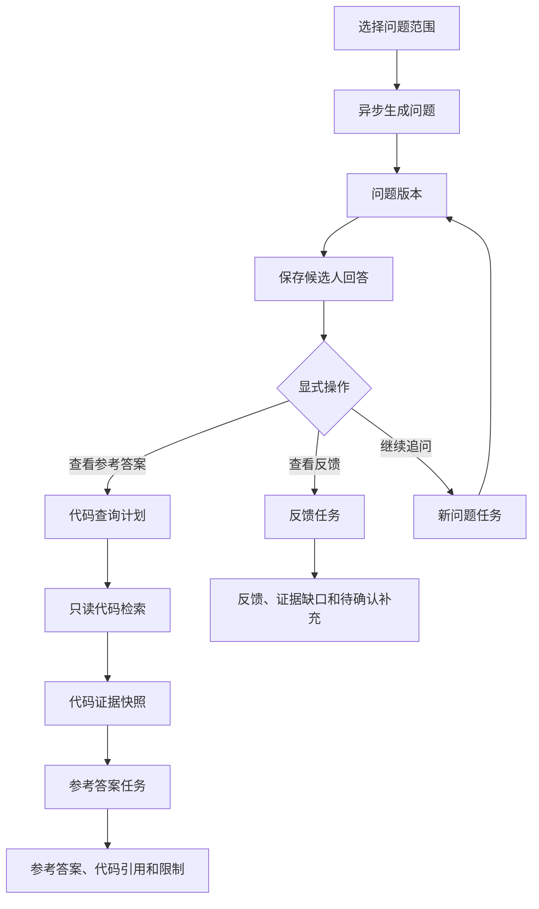

# 核心功能链路

## 材料导入

创建材料集合后，通过统一材料接口上传简历或项目 ZIP。服务校验大小和类型，创建新材料版本并返回 `processing` 状态；解析器抽取文本，OCR 作为图片型 PDF 兜底，项目 ZIP 只静态读取白名单文本文件并脱敏疑似密钥。

当前阶段上传接口不调用远程 LLM：文件和原始证据成功入库后立即返回，本地解析/OCR和规则草稿在后台生成；前端通过材料和识别接口观察 `processing`、`partial`、`ready`、`failed`、`pending`、`awaitingConfirmation` 状态。问题生成和对话属于后续阶段，不能由上传或识别任务触发。

简历解析和结构化识别是两个本地阶段：先保存不可变的原始文件、OCR/解析文本和页级证据，再由本地规则生成可编辑的识别草稿。识别草稿覆盖个人信息、技能掌握、工作/实习经历和项目经验。候选人通过确认表单修正后，确认内容才成为材料集合事实证据；原始文件和 OCR 文本不被表单编辑覆盖。

识别表单按个人信息、技能掌握、工作/实习经历和项目经验分区。技能掌握使用一个完整文本框；工作/实习经历和项目经验按记录保留定位字段，但每条记录只使用一个完整描述框，不再拆分技能标签、嵌套项目、职责、贡献或成果指标。个人项目可以提出与项目档案的匹配建议，但有歧义时必须由候选人确认。OCR 或识别部分失败时保留成功页面和字段，并允许重试或人工补全。

历史拆分草稿通过 `0003_compact_resume_recognition` 和 `0004_clean_compact_resume_content` 迁移为紧凑结构。迁移保留原文成果数字并合并进描述，同时阻止项目内容进入技能段、避免工作/实习经历重复拼接；原始 OCR 证据和已确认事实证据不被静默重写。用户编辑、新增或删除记录后，当前模块自动撤销确认，必须重新确认。

OCR 重试会先清理目标页的旧原始证据，再保存新的页级证据；结构化识别重试只使用原始页/段落证据，不会把已经生成的 `resume-recognition:*` 事实证据再次作为输入。候选人修改已经确认的模块时，该模块的事实证据会撤回，直到再次确认。

材料库支持删除单份当前材料。删除通过新建当前版本完成，历史版本和已绑定旧版本的对话不受影响；原始文件在材料集合删除时统一清理。

项目档案可以在材料行触发静态解析重试；重试只重建当前项目材料的证据，不执行 ZIP 中的代码，也不影响同一版本的其他材料。

## 证据索引

每个证据块关联材料、页码或项目路径。证据可以按关键词查询，前端默认折叠展示引用。项目解析失败不阻断同一版本的简历对话。

结构化字段通过证据关联记录回指原文页码和偏移。未确认的识别草稿可以在当前表单中展示和编辑，但不能作为其他对话的事实证据。

阶段一没有模型返回结果；本地规则生成的非空结构化条目必须带有当前材料中的证据 ID或明确标记为候选人编辑。缺少有效证据引用的条目只能保留为空，不能被保存为事实。

## 后续阶段：对话

创建对话时固定当前 `revisionId`。一个材料集合可以创建多个互相隔离的对话。以上能力不属于阶段一，阶段一只负责产出可追溯的已确认简历事实。

## 缺口和补充

模型发现指标或实现细节缺失时返回澄清问题。候选人补充内容先绑定当前对话，确认后作为独立证据保存，不修改原始简历或项目档案。

## Agent 追问与项目参考答案

Agent 追问属于后续阶段，不能由上传、OCR、简历识别或表单保存触发。候选人先选择问题范围，再点击生成问题；问题由模型生成，候选人不能直接编辑问题文本。

问题生成、反馈、参考答案和继续追问各自创建一个 `llmRun`。接口返回 `202 + runId`，前端轮询任务状态；保存回答只写入数据库并返回 `201`，不调用 LLM。

参考答案节点只能使用问题关联的 `projectArchiveId` 和对应项目版本。代码查询计划由模型生成，但必须经安全执行器校验后才能使用 `rg/grep`、白名单文件读取或 Tree-sitter 静态解析。禁止执行、构建、测试、安装依赖和任意 shell 命令。

参考答案分为 `direct`、`inferred` 和 `insufficient` 三个证据等级。项目证据不足时展示已搜索范围和限制，不补写项目事实；通用知识必须单独触发、单独展示。问题、项目版本或提示版本不变时，参考答案通过指纹复用，不重新生成。
