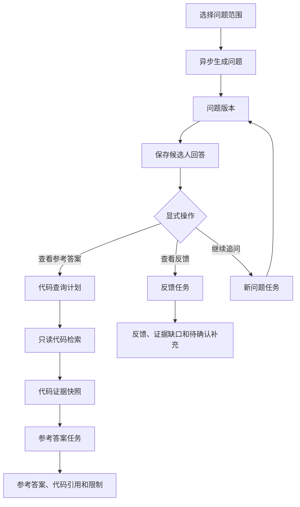
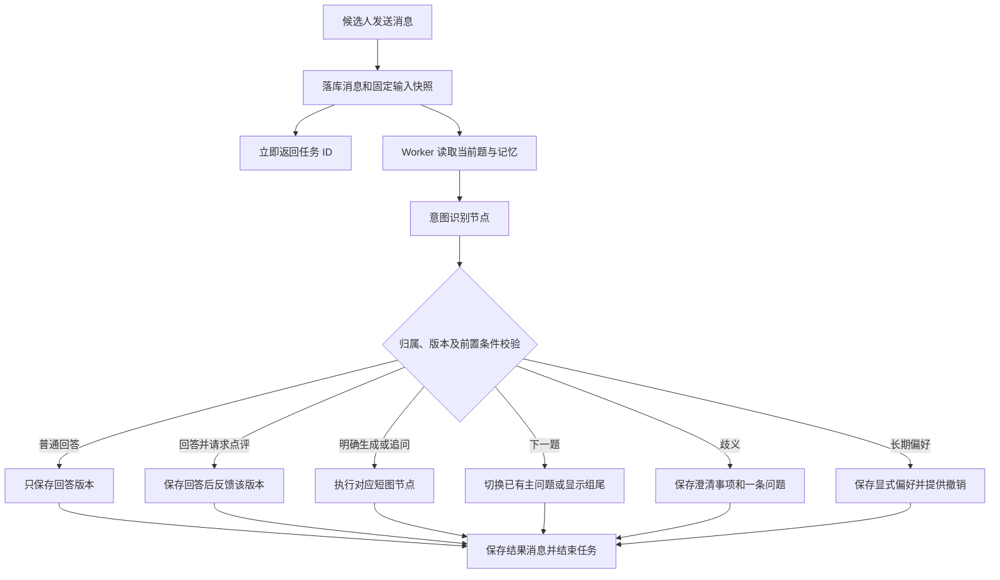
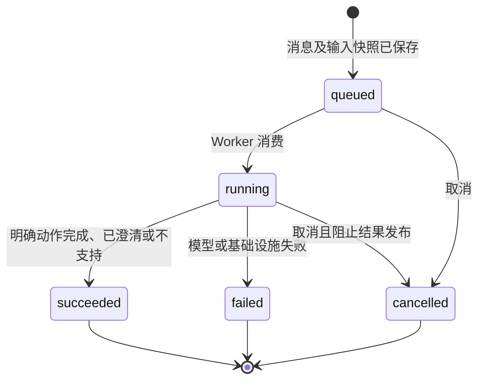
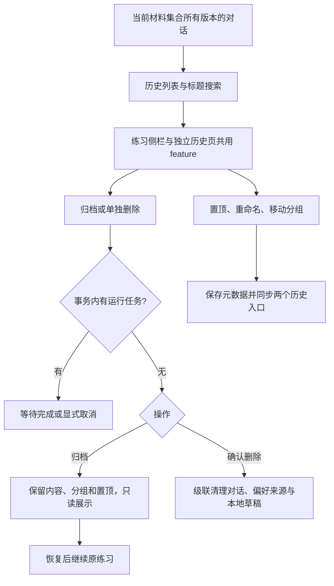

# 核心功能链路

## 材料导入

创建材料集合后，通过统一材料接口上传简历或项目 ZIP。服务校验大小和类型，创建新材料版本并返回 `processing` 状态；解析器抽取文本，OCR 作为图片型 PDF 兜底，项目 ZIP 只静态读取白名单文本文件并脱敏疑似密钥。

当前阶段上传接口不调用远程 LLM：文件和原始证据成功入库后立即返回，本地解析/OCR和规则草稿在后台生成；前端通过材料和识别接口观察 `processing`、`partial`、`ready`、`failed`、`pending`、`awaitingConfirmation` 状态。问题生成和对话属于后续阶段，不能由上传或识别任务触发。

简历解析和结构化识别是两个本地阶段：先保存不可变的原始文件、OCR/解析文本和页级证据，再由本地规则生成可编辑的识别草稿。识别草稿覆盖个人信息、技能掌握、工作/实习经历和项目经验。候选人通过确认表单修正后，确认内容才成为材料集合事实证据；原始文件和 OCR 文本不被表单编辑覆盖。

识别表单按个人信息、技能掌握、工作/实习经历和项目经验分区。技能掌握使用一个完整文本框；工作/实习经历和项目经验按记录保留定位字段，但每条记录只使用一个完整描述框，不再拆分技能标签、嵌套项目、职责、贡献或成果指标。个人项目可以提出与项目档案的匹配建议，但有歧义时必须由候选人确认。OCR 或识别部分失败时保留成功页面和字段，并允许重试或人工补全。

历史拆分草稿通过 `0003_compact_resume_recognition` 和 `0004_clean_compact_resume_content` 迁移为紧凑结构。迁移保留原文成果数字并合并进描述，同时阻止项目内容进入技能段、避免工作/实习经历重复拼接；原始 OCR 证据和已确认事实证据不被静默重写。用户编辑、新增或删除记录后，当前模块自动撤销确认，必须重新确认。

OCR 重试会先清理目标页的旧原始证据，再保存新的页级证据；结构化识别重试只使用原始页/段落证据，不会把已经生成的 `resume-recognition:*` 事实证据再次作为输入。候选人修改已经确认的模块时，该模块的事实证据会撤回，直到再次确认。

材料库支持删除单份当前材料。删除通过新建当前版本完成，历史版本和已绑定旧版本的对话不受影响；原始文件在材料集合删除时统一清理。

项目档案可以在材料行触发静态解析重试；重试只重建当前项目材料的证据，不执行 ZIP 中的代码，也不影响同一版本的其他材料。

## 证据索引

每个证据块关联材料、页码或项目路径。证据可以按关键词查询，前端默认折叠展示引用。项目解析失败不阻断同一版本的简历对话。

结构化字段通过证据关联记录回指原文页码和偏移。未确认的识别草稿可以在当前表单中展示和编辑，但不能作为其他对话的事实证据。

阶段一没有模型返回结果；本地规则生成的非空结构化条目必须带有当前材料中的证据 ID或明确标记为候选人编辑。缺少有效证据引用的条目只能保留为空，不能被保存为事实。

## 后续阶段：对话

创建对话时固定当前 `revisionId`。一个材料集合可以创建多个互相隔离的对话。以上能力不属于阶段一，阶段一只负责产出可追溯的已确认简历事实。

## 缺口和补充

模型发现指标或实现细节缺失时返回澄清问题。候选人补充内容先绑定当前对话，确认后作为独立证据保存，不修改原始简历或项目档案。

## 阶段六：Agent 追问与项目参考答案

Agent 追问属于后续阶段，不能由上传、OCR、简历识别或表单保存触发。候选人先选择问题范围，再点击生成问题；问题由模型生成，候选人不能直接编辑问题文本。

问题生成、反馈、参考答案和继续追问各自创建一个 `llmRun`。接口返回 `202 + runId`，前端轮询任务状态；保存回答只写入数据库并返回 `201`，不调用 LLM。任务默认由本地线程 worker 执行，部署 Redis 并设置 `TASK_QUEUE_BACKEND=celery` 后由 Celery worker 消费；LangGraph 每次只运行一个 `START -> execute -> END` 短图。

当前前端新增“面试练习”导航：先选择简历模块、练习方向和问题数量，再点击“生成问题”；参考答案按钮才会启动绑定项目的只读代码检索任务。未选择项目档案时，参考答案明确返回 `insufficient`，不会从材料库其他项目猜测。

当前阶段参考答案节点使用 `EmptyCodeEvidenceProvider`，只返回 `insufficient` 和“代码证据尚未启用”。代码检索接口保留给后续阶段；启用后只能使用问题关联的 `projectArchiveId` 和对应项目版本，计划必须经安全执行器校验。禁止执行、构建、测试、安装依赖和任意 shell 命令。

参考答案分为 `direct`、`inferred` 和 `insufficient` 三个证据等级。当前阶段固定为 `insufficient`；项目证据不足时展示限制，不补写项目事实。问题版本、空代码快照和提示版本不变时，参考答案通过指纹复用，不重新生成。

## 阶段七：对话式练习（已实现）

需求与实施顺序见[对话式练习需求](../requirements/conversation-practice.md)和[开发计划](../plans/CONVERSATION_PRACTICE_PLAN.md)。上面的参数表单属于阶段六；阶段七使用白色对话页、单输入框、历史侧栏和顶部只读简历面板。

上下文分别组装对话事实快照、短期练习状态、近期消息/较早摘要和显式长期偏好。当前指令优先于本轮要求、长期偏好和默认值。具体回答、反馈及模型评价不会跨对话成为事实。同一对话一次只处理一个改变状态的输入；重复提交和重试通过消息身份及步骤完成记录去重。

澄清作为成功业务结果落库后立即结束短图，下一条输入读取待澄清事项重新识别，不在 Worker 中等待候选人。显式重试创建新的运行记录；回答已保存而反馈失败时，只重试未完成步骤。

对话创建时保存已确认简历与证据快照，简历面板和任务共用这份事实边界。上传新版本或修改确认表单不改写旧对话；历史快照缺失时提示限制，不能用最新内容冒充。打开简历、刷新和切换对话不调用模型。

结构化识别走真实模型节点，提示中提供完整 JSON Schema。只有解析/校验失败尝试一次结构修复；网络失败直接记录任务失败，等待显式重试，不把网络故障误判为格式错误额外调用模型。测试替身的固定意图行为仅用于无凭据演示和自动化测试。

短期上下文保留最近 12 条消息和有消息编号边界的较早摘录摘要；按字符预算裁剪，默认 24000 字符。摘要与原始消息完整保存在数据库，不作为事实证据。长期偏好必须有当前输入依据，取消/删除偏好后旧摘要不能恢复它。客户端只暂存输入草稿和选择的对话/集合 ID，删除集合同时清理对应草稿、选择记录和查询缓存。

删除材料集合时同时清理短期状态、摘要、事实快照、消息和任务；移除该集合对应的长期偏好来源，无其他来源的偏好删除。任务取消或集合删除后禁止成功回写；参考答案仍按问题版本不可变，代码证据继续返回 `insufficient`。

## 阶段八：历史对话管理（已实现）

需求及顺序见[历史对话管理需求](../requirements/conversation-history.md)和[开发计划](../plans/CONVERSATION_HISTORY_PLAN.md)。以下链路已经落地，并通过后端集成和真实浏览器验收。

管理操作不推进最近练习时间、不创建材料版本或改写事实快照。分组删除把普通及归档对话全部转为未分组，不删除对话；搜索覆盖两种状态并显示归档标识。归档状态必须在所有后端内容写入口检查，不能仅隐藏输入框。

归档当前对话后仍展示消息、简历与恢复按钮；刷新保留当前选择及只读状态，未发送草稿保留。单独删除当前对话清理选择、缓存和草稿并显示空白入口，不自动创建新对话。集合删除获取全量对话 ID 时显式包含归档记录，同时清理分组折叠状态，避免因日常筛选留下本地数据。
