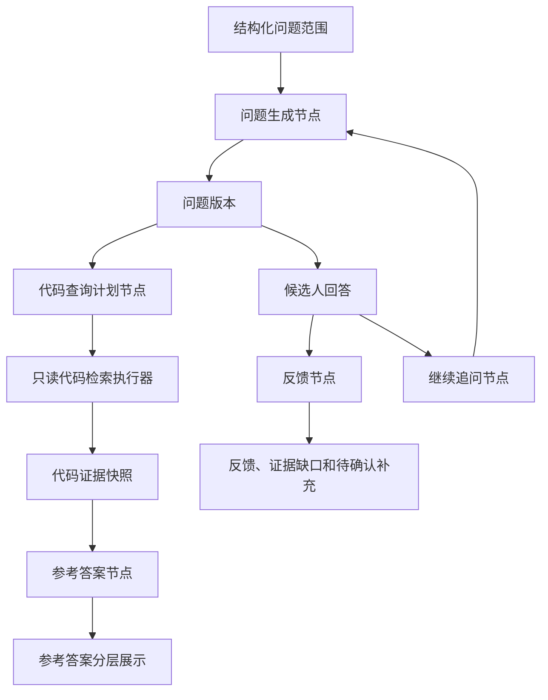

# Agent 追问与项目参考答案需求

状态：需求已确认，尚未实现

## 1. 目标

基于候选人指定的问题范围生成面试练习问题，并通过候选人上传的真实项目档案生成可追溯的项目参考答案，帮助候选人发现理解缺口，练习到能够独立解释自己的项目并回答面试者的追问。

“面试练习”指候选人回答系统生成的问题，不是训练大模型。候选人的回答、反馈、参考答案和补充内容都属于当前对话，不能未经确认改写简历或项目事实。

## 2. 范围与边界

### 2.1 本期建设

- 候选人选择结构化问题范围，由模型生成问题；问题不能由候选人直接改写。
- 候选人保存回答时不调用 LLM。
- 候选人显式点击“查看反馈”“查看参考答案”或“继续追问”时，分别创建一次异步 LLM 任务。
- 问题节点根据候选人选择的问题范围使用已确认材料证据，不局限于简历事实，但不能越过当前材料集合和对话版本边界。
- 参考答案节点读取已绑定项目档案的只读代码证据，不执行、构建、测试或修改上传代码。
- 参考答案保存代码证据快照、证据等级、检索范围和限制说明。
- 候选人补充内容先作为待确认内容绑定当前对话，确认后才成为独立证据。

### 2.2 不在本期

- 人工直接编辑模型生成的问题文本。
- 上传或识别简历时自动调用 LLM。
- 自动把候选人回答写回简历或项目事实。
- 任意 shell 命令、代码执行、构建、测试、依赖安装或网络访问。
- 跨材料集合、跨对话的长期候选人画像。
- 自主多 Agent 协作、ReAct 循环或让模型自行决定是否执行工具。

## 3. 术语

- **问题范围**：结构化的 `scopeType`、目标材料/项目/证据 ID、主题和训练方向。候选人可以选择简历模块、项目档案、具体项目、选中文本或自定义训练方向。
- **问题版本**：一次模型生成的问题及其范围、材料版本、项目版本和提示版本的不可变记录。
- **参考答案**：基于问题和项目代码证据生成的可追溯解释，不代表唯一正确答案。
- **代码证据快照**：文件路径、行号、代码片段、检索范围和证据等级的不可变记录。
- **候选人回答**：候选人在当前练习轮次提交的文本，不自动成为事实。
- **候选人补充内容**：回答中可能新增的项目细节，确认前只服务于当前对话。
- **LLM 运行任务**：一次问题、参考答案、反馈或继续追问调用的异步任务。

## 4. 用户流程

```text
选择问题范围
  -> 点击生成问题
  -> 异步生成问题
  -> 查看问题并保存候选人回答
  -> 选择查看反馈、查看参考答案或继续追问
  -> 异步执行对应节点
  -> 展示证据、限制、反馈和待确认补充
  -> 继续下一轮或结束对话
```

保存回答本身不得调用 LLM。所有模型调用必须由候选人显式点击触发。

## 5. LangGraph 节点



### 5.1 问题生成节点

输入包括问题范围、当前材料版本、已确认简历事实、相关项目证据、对话摘要和最近练习轮次。问题由模型生成，候选人只能调整问题范围或点击“换一个问题”，不能直接编辑问题文本。

默认问题路径为事实确认、实现细节、技术取舍、失败复盘和扩展设计；模型可以根据回答暴露的证据缺口调整下一轮方向。

### 5.2 代码查询计划节点

模型只输出结构化查询计划，例如候选路径、符号名称、关键词、查询目的和最大范围。计划必须由安全执行器校验，模型不能输出或执行任意 shell 命令。

### 5.3 只读代码检索执行器

执行器可以使用 `rg/grep`、白名单文件读取和 Tree-sitter 静态解析。执行器必须限制路径、文件数量、单文件大小、总读取大小和执行时间；排除 `.git`、依赖目录、构建产物、日志和疑似密钥文件。

### 5.4 参考答案节点

参考答案必须区分：

1. `direct`：代码中有直接文件、函数、配置或调用关系证据。
2. `inferred`：由多个代码证据归纳出的解释，需要明确标记为推断。
3. `insufficient`：当前项目版本和检索范围不足以确认，不得补写项目事实。

如果需要通用知识解释，必须单独由候选人点击“查看通用知识”触发，并与项目参考答案分区展示。

### 5.5 反馈节点

反馈比较候选人回答、问题目标、已确认简历事实、代码证据和参考答案，但参考答案只是辅助解释，不能替代原始证据。反馈默认包含回答覆盖度、证据一致性、技术完整性、实际负责范围、待补充细节和下一步练习建议，不默认生成总分。

## 6. 问题范围与版本

问题范围使用结构化输入：

```json
{
  "scopeType": "resumeSection|project|selectedEvidence|customTopic",
  "targetIds": ["uuid"],
  "topic": "缓存一致性和失败处理",
  "questionType": "implementation",
  "difficulty": "medium"
}
```

同一范围重复点击默认返回当前问题；只有点击“换一个问题”才创建新问题版本。问题输入指纹至少包含范围、材料版本、项目版本、提示版本和生成约束。

问题文本、范围或材料版本改变时，旧问题和旧参考答案保留为历史；新版本必须重新生成参考答案。候选人不能直接编辑问题文本。

## 7. 参考答案稳定性

参考答案仅在候选人点击“查看参考答案”后生成。参考答案指纹包含问题版本、项目档案版本、代码证据快照和提示版本。指纹未变化时重复查看直接返回原结果，不重新调用 LLM；需要改进时只能通过新问题版本、项目版本或提示版本生成新答案。

没有明确绑定的 `projectArchiveId` 时，不自动从全部项目档案猜测；系统提示候选人绑定项目或追加检索范围。

## 8. 异步任务与状态

使用 `Celery + Redis` 执行长链路任务，LangGraph 在 Worker 中一次运行一个任务，不在图内等待候选人输入。任务状态为：

```text
queued -> running -> succeeded
queued -> cancelled
running -> cancelled
running -> failed -> queued（用户显式重试）
```

网络错误和 5xx 只做有限队列重试；结构化输出校验失败最多进行一次 schema repair；业务失败由候选人显式重试。每次重试创建新的 `llmRun`，保留旧任务和错误摘要。

前端通过 `runId` 轮询任务状态。任务结果只返回绑定对话和材料版本范围内的结构化结果，不能仅凭 `runId` 越权读取。

## 9. 持久化

- `practice_turns`：一轮问题、回答、反馈、参考答案状态和轮次序号。
- `question_versions`：问题文本、问题范围、输入指纹、材料版本、项目版本和提示版本。
- `reference_answers`：参考答案文本、证据等级、限制、版本指纹和生成任务 ID。
- `code_evidence_snapshots`：项目版本、文件路径、起止行号、代码片段、检索范围和内容哈希。
- `llm_runs`：任务类型、节点、状态、输入指纹、耗时、结构化输出和错误摘要。
- `messages`：兼容已有对话展示和审计记录。

不保存完整 prompt、模型隐藏推理过程或未经脱敏的完整项目 ZIP。代码片段、任务和消息必须随材料集合删除级联清理。

## 10. API 方向

```text
POST /api/v1/conversations/{conversationId}/question-runs
POST /api/v1/practice-turns/{turnId}/answers
POST /api/v1/practice-turns/{turnId}/feedback-runs
POST /api/v1/practice-turns/{turnId}/reference-answer-runs
POST /api/v1/practice-turns/{turnId}/follow-up-runs
GET  /api/v1/llm-runs/{runId}
GET  /api/v1/conversations/{conversationId}/practice-turns
```

所有创建 LLM 任务的接口返回 `202` 和 `runId`；保存回答返回 `201`，且不得创建 LLM 任务。JSON 使用 `camelCase`，错误使用 Problem Details 和稳定 `code`。

## 11. 安全与隐私

- 只读取已绑定项目版本的隔离目录。
- ZIP 解压防止路径穿越、绝对路径和符号链接逃逸。
- 禁止执行、构建、测试、安装依赖和网络访问。
- 代码检索计划由执行器校验，不能执行模型生成的原始命令。
- 简历联系方式和疑似密钥不得发送给 LLM。
- 任务日志只保留结构化元数据、脱敏统计、证据引用和错误摘要。
- 客户端永远不能取得 LLM API Key。

## 12. 验收标准

1. 只有点击生成问题、查看反馈、查看参考答案或继续追问时才创建 LLM 任务。
2. 保存候选人回答不会调用 LLM，刷新后回答仍存在。
3. 同一问题、项目版本和提示版本下，参考答案指纹不变且不会重复生成。
4. 问题范围变化会创建新问题版本，旧问题和旧参考答案仍可查看。
5. 参考答案每个项目事实都有代码路径和行号，推断和证据不足明确标记。
6. 没有项目绑定时不会跨项目猜测代码来源。
7. 代码检索不会执行、构建、测试或安装上传代码。
8. LLM 任务失败可查询、可显式重试，失败记录不会覆盖历史任务。
9. 未确认候选人补充内容不会出现在其他对话事实证据中。
10. 删除材料集合后，代码快照、参考答案、任务、消息和对话均不可检索。

## 13. 明确不在本需求内

- 人工编辑模型生成的问题。
- 自动长期记忆和跨对话画像。
- 多 Agent 自主协作和任意工具调用。
- 执行或修改候选人上传的项目代码。
- 把通用知识解释伪装成项目参考答案。
