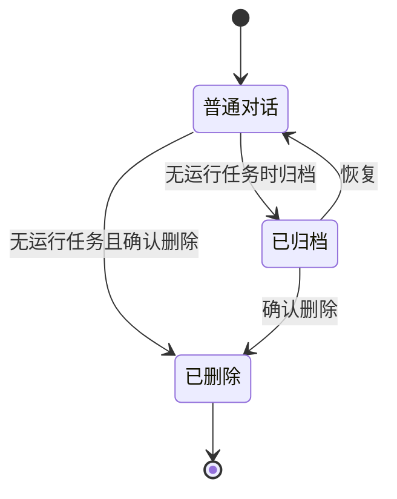

# 历史对话管理需求

状态：2026-10-09 需求已确认并完成实现；已通过单元、集成、迁移、构建和真实浏览器端到端验收。

配套文档：[开发计划](../plans/CONVERSATION_HISTORY_PLAN.md)、[API 契约](../api/rest-contract.md)、[验收矩阵](../acceptance/test-gates.md)。根目录 `PROCESS.md` 阶段八记录执行进度。

## 1. 目标与范围

候选人可以整理当前材料集合的历史对话：置顶、单层分组、归档与恢复、重命名、按标题搜索以及单独删除对话。练习页侧栏和独立历史页面使用一致的数据与规则，刷新后恢复管理结果。

范围包含当前材料集合所有材料版本下的对话。管理操作不修改对话绑定的材料版本、事实快照、问题版本或参考答案，也不调用 LLM。

本次不增加跨集合移动、多标签、嵌套分组、模型分类、拖拽排序、批量操作或回收站。继续沿用本地单用户边界，不新增身份系统、依赖或服务。

## 2. 置顶与排序

- 普通列表顶部独立展示“置顶”，按 `pinnedAt` 倒序；同时间按对话 ID 升序稳定排序。
- 其余对话按分组展示，组内按 `lastActivityAt` 倒序、ID 升序排序。未分组显示在自定义分组之后。
- 置顶对话保留分组归属，只在置顶区域展示一次；搜索结果也不重复。
- 自定义分组按创建时间升序、ID 升序排列，允许空组，支持折叠。
- 重复置顶不改变置顶时间；取消后重新置顶取得新的时间。不设置数量限制。
- `lastActivityAt` 表示最近已持久化的练习活动：消息或回答保存、导航成功、助手结果发布。管理操作、读取、轮询和仅任务状态变化不推进该时间。
- `updatedAt` 继续记录普通记录更新时间，管理操作可以改变它；列表不能再依赖它表示练习活跃度。

## 3. 单层分组

- 分组属于材料集合，一个对话只能属于一个分组，也可以属于“未分组”。移动分组不移动材料，不创建新对话。
- 支持创建、重命名、删除分组，以及移动普通或归档对话。
- 名称去除首尾空白，长度 1–80 字符；同集合按去空白、大小写折叠后的名称唯一。不同集合可以使用相同名称。
- “置顶”“未分组”“已归档”为保留名称；对话标题去除首尾空白后长度 1–200 字符，允许重名。
- 分组删除需确认“只删除分组，所有普通及归档对话转为未分组”；操作在一个事务中完成，不删除对话。
- 跨集合分组关联必须由后端拒绝，不能仅依赖前端选项限制。

## 4. 归档与恢复

归档从日常列表隐藏对话，保留消息、问题、回答、记忆、事实快照、分组和置顶时间。已归档入口提供独立列表，不把归档对话显示在日常置顶区。



- 已归档对话可以查看历史消息、题目结果和绑定版本简历；顶部明确显示归档状态和恢复按钮。
- 归档后禁止新输入、保存回答、生成问题、反馈、参考答案、追问、导航、任务重试及候选人补充确认等内容写入；旧兼容接口同样检查。
- 允许重命名、修改置顶、移动分组、恢复和删除。偏好管理仍是已有独立能力，归档不删除偏好来源。
- 存在 `queued` 或 `running` 任务时禁止归档和单独删除，提示等待完成或先取消；允许重命名、置顶和移动分组。
- 后端在同一事务中协调任务提交与归档/删除，不能只先查询忙碌状态再无锁写入。发布结果沿用现有最终状态检查，取消后的迟到结果不能回写。
- 恢复后按原置顶时间和分组重新排序；原分组已经删除则进入未分组。恢复不生成消息、不调用模型。
- 重复归档或恢复是幂等操作。归档当前对话不丢弃未发送草稿；恢复后草稿可继续编辑。

## 5. 页面与搜索

保持白色简约风，练习侧栏按下面的顺序组织：

```text
新建对话
搜索对话标题
置顶
自定义分组（可折叠，提供新建分组）
未分组
已归档入口
```

- 每条对话提供“⋯”菜单：置顶/取消置顶、重命名、移动分组、归档/恢复、删除。图标操作有文字名称，支持键盘、焦点返回和窄屏触控。
- 已归档列表保留置顶标识，按置顶优先及对应时间排序；打开后停留在只读对话，恢复按钮始终可见。
- 搜索仅匹配标题，去除查询首尾空白后按大小写不敏感的字面子串匹配；`%`、`_` 等不是通配符。搜索长度不超过 200 字符。
- 搜索覆盖当前集合的普通及归档对话；结果显示分组和归档状态，按置顶优先、置顶时间或最近练习时间排序。
- 搜索为空返回原列表；无结果、空分组、无历史、请求失败和保存中都有明确状态。失败保留输入并允许用户显式重试，不假装保存成功。
- 两个入口共用历史 feature、API、类型和查询缓存；独立历史页面只组合 feature，不直接发起业务查询。
- 管理成功后同步刷新两个入口及当前对话元数据；刷新可以恢复选择和归档只读状态，不因普通列表缺少该 ID 就自动覆盖当前选择。
- 侧栏分组折叠状态按集合本地保存；切换集合不沿用其他集合的分组，删除组/集合清理相关本地状态。

## 6. 单独删除与集合删除

单独删除使用明确二次确认，说明无法恢复，并显示对话名称。服务端事务删除该对话的旧消息、练习消息、输入、短期状态/摘要/事实快照、问题版本、轮次、回答、反馈、参考答案、任务和候选人补充，以及其长期偏好来源。没有其他来源的偏好删除；其他对话的独立来源保留。

材料原始文件、材料版本、OCR 和材料证据继续保留。已经冻结到其他对话的事实快照不重写；共享的材料版本级代码快照保留，不因删除一个对话影响其他对话。

删除成功后，前端清理对应草稿、选中记录、详情和任务缓存；删除当前对话显示空白练习入口，不自动创建对话或调用模型。重复删除同一 ID 返回成功。

材料集合删除继续执行原有全量清理，并增加分组、归档/置顶元数据和折叠状态清理。客户端取得完整对话 ID 清单时必须包含归档对话，避免遗留本地草稿。集合整体删除沿用原有运行任务删除规则，不改成单独删除的忙碌限制。

## 7. 验收与兼容

- 旧对话迁移为未分组、未置顶、未归档；最近练习时间以旧 `updatedAt` 回填，只是历史近似值，迁移后按新活动规则更新。
- 现有列表接口不带过滤参数时保持返回全部对话，客户端新日常视图显式请求普通对话；管理字段只做增量扩展。
- 必须通过领域单元、公共 HTTP 集成、真实浏览器端到端、前端构建和迁移测试。测试使用隔离数据库和既有 Fake LLM，不向真实模型发送请求。
- 必须验证刷新持久化、两个入口一致、旧版本可读、分组跨集合限制、归档后所有内容写入口被拒绝、忙碌竞争、取消后删除不回写，以及删除级联。
- 任一必需门禁未通过或未执行，本功能不得标记完成。
