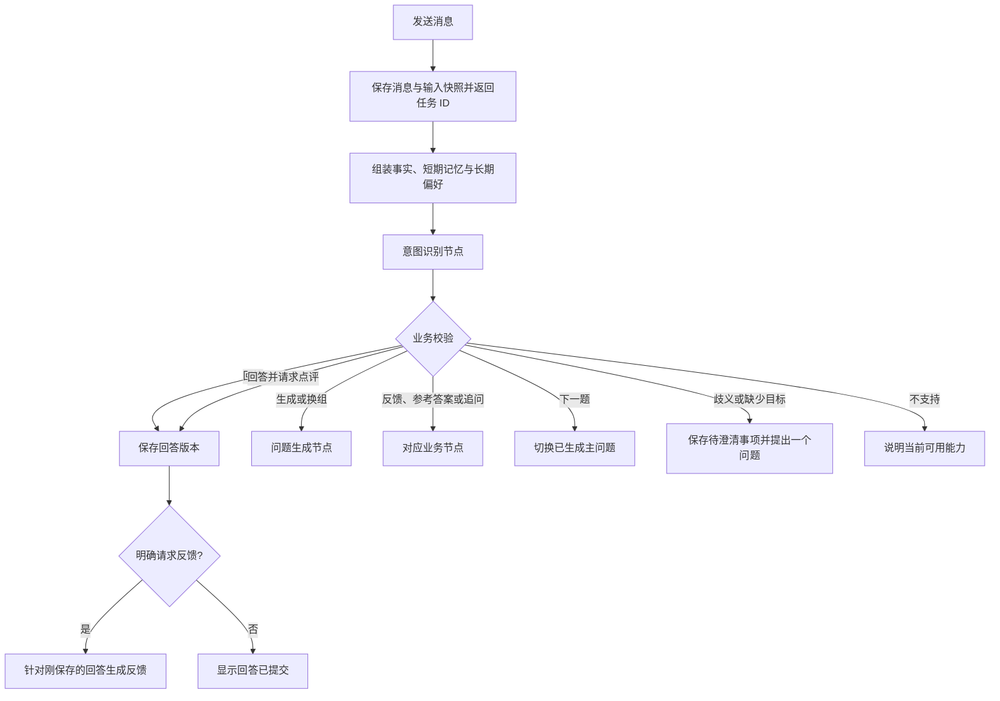

# 对话式练习、意图识别与记忆需求

状态：已实现，2026-10-09 完成三层验收；真实代码证据仍暂缓。

本文件定义阶段七目标。它替代旧练习页的模块/难度表单和“所有消息都不得调用模型”的交互边界；旧的回答保存接口仍只保存数据。原有问题版本、回答版本、参考答案不可变及代码证据暂缓规则继续有效。

实现入口：后端 `service/practice_service.py`、`repository/practice_repository.py`、`domain/practice_intent.py`，前端 `features/practice/PracticePanel.tsx` 和 `api/practice.ts`。迁移为 `0006_conversation_practice`；验收证据见[验收矩阵](../acceptance/test-gates.md)。

## 1. 页面布局

练习页保持白色简约风，左侧显示新建对话、历史对话和材料库入口，中央显示消息流，底部固定一个输入框。练习页不再同时展示全局侧栏和参数侧栏；材料库及简历确认页保留现有功能。

```text
左侧历史对话 | 顶部：对话名称、当前题进度、查看简历
             | 中央：问题、候选人回答、反馈、参考答案、追问
             | 底部：统一输入框、发送按钮、任务状态
```

- 移除模块、难度、问题类型及数量配置表单。候选人通过自然语言指定主题、范围和数量；不显示难度评级。
- 问题仍批量生成，默认沿用现有 5 题设置；逐题呈现，问题目录可展开，显示主问题进度。
- 反馈、参考答案和追问作为带有类型标识的助手消息展示。回答保留版本标识。
- 保留反馈、参考答案、继续追问、下一题的快捷操作。快捷操作直接调用已明确的业务动作，不必再次识别意图。
- 不设置“回答 / 指令”模式切换，输入类型由意图节点结合上下文判断。
- 发送中显示排队/识别/执行状态；同一对话按消息顺序处理，避免多个输入同时改变当前题。输入草稿在提交失败时保留，支持显式重试和取消。
- 支持键盘操作和窄屏布局，消息区与简历面板分别滚动；阅读旧消息时不强制滚动到底部。

## 2. 顶部查看简历

点击“查看简历”打开可关闭的右侧面板，保留对话与输入草稿。窄屏使用覆盖面板。

- 默认按章节展示当前对话绑定材料版本的已确认简历，能切换查看原文依据。
- 显示所绑定版本及文件名称；多个绑定简历通过面板内文件选择切换。
- 未确认章节明确提示，不把识别草稿作为事实展示。
- 面板只读，编辑入口跳转现有确认页，并说明编辑的是当前材料版本，不改写旧对话快照。
- 对话创建时保存确认内容和证据快照。任务使用同一事实边界，后续编辑或删除当前材料不覆盖历史对话。
- 旧对话缺少可恢复快照时明确提示缺失，不用最新简历冒充旧版本。
- 打开、关闭和查看简历不调用 LLM。

## 3. 自然语言与意图识别

每条由输入框提交的消息创建异步处理任务。Worker 先读取固定输入快照，经 `intentNode` 输出经过 Pydantic 校验的意图，再由业务服务校验并执行。所有真实模型调用复用现有 LLM 适配器。



可识别动作：提交回答、生成问题、换一组问题、查看反馈、查看参考答案、继续追问、下一题、更新练习偏好。一个输入允许“保存回答 + 一个明确的业务请求”，不执行模型自行扩展出的任意动作链。

意图结果区分 `recognized`、`needsClarification` 和 `unsupported`，包含目标轮次、规范化范围、回答正文、请求动作、偏好更新及必要的澄清文本。后端必须检查对话归属、版本、目标存在性、回答前置条件和重复任务，模型输出不是执行授权本身。

| 输入场景 | 行为 |
|---|---|
| “针对实习中的 Redis 生成 5 个问题” | 识别主题与范围后生成 |
| 回答正文没有请求点评 | 意图识别后只保存，不自动反馈或追问 |
| 回答正文 + “请点评” | 先保存，再反馈；反馈固定绑定该回答版本 |
| “再深入一点”，当前有明确问题和回答 | 针对当前题继续追问 |
| “换成消息队列”，历史不足以确定换题还是换组 | 先提出一个简短澄清问题 |
| “下一题” | 切换已有下一主问题，不重新生成问题 |
| 当前问题组已结束，用户说“下一题” | 显示完成状态；用户明确要求新一组才生成 |
| 指令提到未上传材料或未确认事实 | 提示补充/确认，不扩大证据范围猜测 |

**模型调用规则变化**：输入框中的回答也进行一次意图识别；保存回答的持久化步骤不调用模型。反馈、参考答案和追问只因明确请求启动。上传、OCR、确认表单保存、查看简历、刷新和切换对话均不自动调用模型。

## 4. 短期记忆与上下文

短期记忆只属于当前对话：当前主问题、追问链、最新回答版本、当前主题、最近指令、最近消息和未完成的澄清事项。刷新后从数据库恢复，不只保存在前端或 Worker 内存。

完整消息历史保留在数据库；上下文选取当前问题/回答、待澄清事项、相关已确认事实、近期消息和较早历史摘要。摘要记录覆盖的消息边界及来源，不具有事实证据地位。长上下文按优先级裁剪，保留当前消息和关键目标，不能无条件发送全部历史或全部材料。

任务提交时固定对话版本、事实快照、当前题、回答版本、近期消息边界和偏好版本；执行期间发生的编辑不会改变该任务输入。切换主问题后清理上一题待澄清事项，避免旧指令错误作用于新题。

## 5. 长期记忆

长期事实继续使用已确认简历、项目证据及候选人已确认补充，并按材料版本读取。它们不能通过记忆节点绕过确认机制。

跨对话共享的是候选人明确表达的练习偏好，例如“以后一次只问一道题”。当前本地单用户范围沿用现有运行边界，不引入新身份系统。

- 明确长期表达自动保存，并显示可撤销提示；记录原始指令、来源对话和作用范围。
- 偏好变更必须附带当前输入的逐字依据 `instructionQuote`；历史消息、摘要或模型推测没有当前指令依据时不写入。
- “这次、这一轮”等要求只进入短期记忆；推测出的偏好不自动保存。
- 当前明确指令优先于本轮要求，本轮要求优先于长期偏好，最后使用默认值。
- 用户可查看、修改、删除偏好；删除后不通过摘要再次恢复该偏好。
- 具体回答、反馈、模型判断和未确认补充不跨对话共享。
- 删除材料集合必须清理关联消息、记忆、摘要、事实快照、任务和来自该集合的偏好来源；无剩余来源的偏好删除，其他集合的独立偏好不受影响。

## 6. 任务、安全与兼容

- 复用现有 LangGraph、LangChain 和队列，无新增记忆框架或独立服务。
- 澄清保存到数据库后结束本次短图，下次输入重新识别；不在图内等待人类输入。
- 同一消息重试不得重复保存回答、生成已完成结果或写入偏好。取消后不得发布成功结果，已提交回答保留且可明确查询。
- 新接口和数据结构遵循 `/api/v1`、camelCase、Problem Details 和现有分层约束。
- 简历/代码中的文字、历史助手输出和摘要属于数据，不得覆盖系统约束。个人信息和疑似密钥在发送前脱敏。
- 参考答案继续绑定问题版本；回答修改、记忆更新和页面改造均不能改写旧参考答案。
- 代码证据本阶段暂缓，明确返回 `insufficient`。不执行上传代码，不开放任意工具调用。
- 旧 HTTP 接口兼容保留，新消息流不使用同步 LLM 消息接口。

## 7. 验收

单元测试验证意图结构、范围校验、记忆优先级、上下文裁剪、偏好写入边界和主问题/追问区别；集成测试验证消息处理、版本快照、回答与反馈绑定、幂等/取消、澄清恢复及删除级联。

真实浏览器必须完成：发自然语言生成指令 → 看到首题 → 回答 → 查看反馈/参考答案 → 继续追问 → 下一题 → 查看绑定版本简历 → 保存/撤销长期偏好 → 刷新恢复 → 删除集合。

现有 API smoke 不等价于浏览器验收。单元、集成、浏览器端到端及迁移门禁未全部通过时，阶段不得标记完成。
